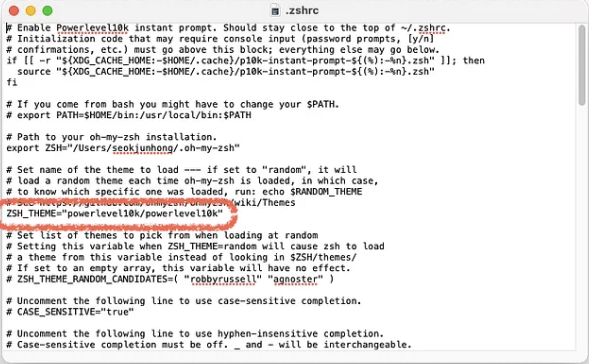
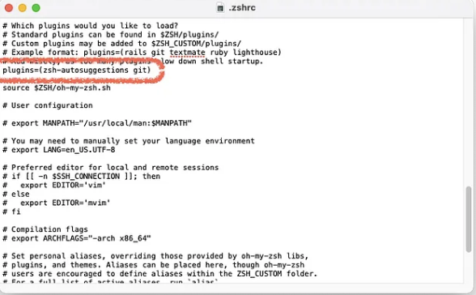
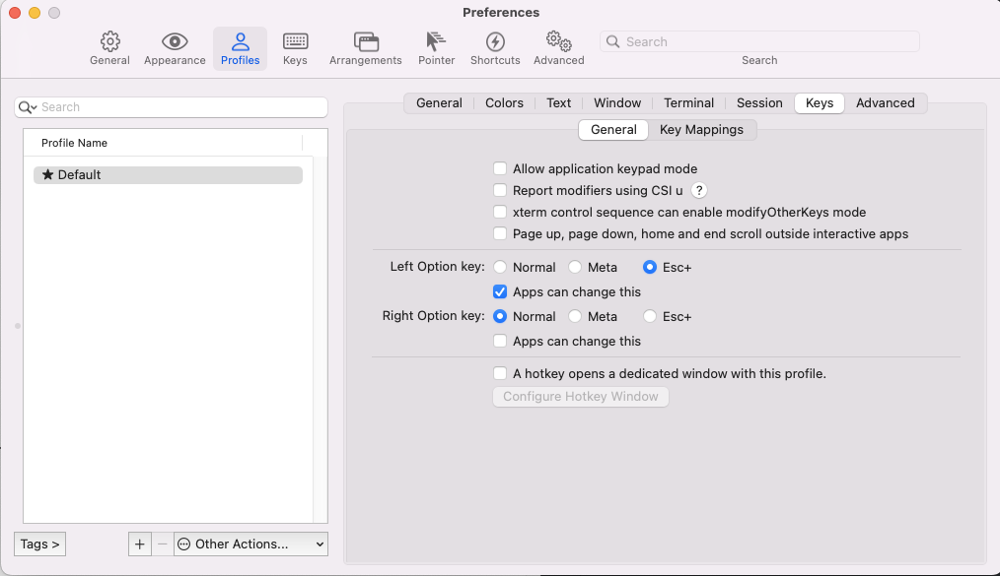
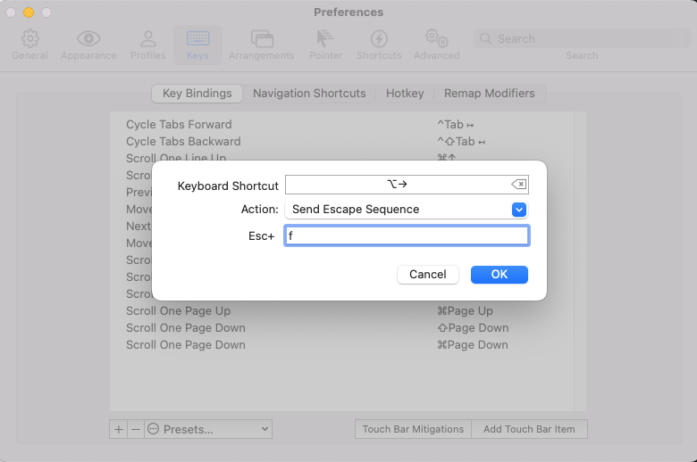
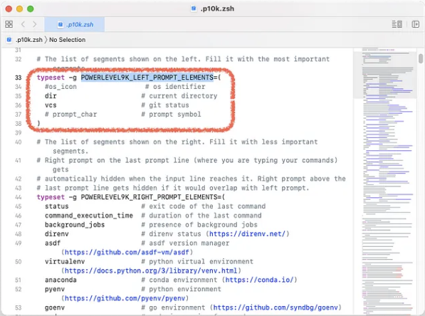

# Initial setup of working environment


## From Console
1. Install brew
```bash
/bin/bash -c "$(curl -fsSL https://raw.githubusercontent.com/Homebrew/install/HEAD/install.sh)"```
```
2. Install iterm2
```bash
brew cask install iterm2
```
3. Install iTerm2
```bash
brew install --cask rectangle
```

4. Install Oh My Zsh
```bash
sh -c "$(curl -fsSL https://raw.githubusercontent.com/ohmyzsh/ohmyzsh/master/tools/install.sh)"
```

5. Install Powerlevel10k
```bash
git clone https://github.com/romkatv/powerlevel10k.git $ZSH_CUSTOM/themes/powerlevel10k
```
Then open ~/.zshrc file with $ open ~/.zshrc
and set ZSH_TEME=“powerlevel10k/powerlevel10k”


6. Quit iTerm and reopen. 

Go thought the configurator that will pop up on the console acording to your needs

7. iTerm2 customizations

iTerm → Preferences → Profiles → Colors → Color Presets → Solarized Dark

8. Auto-suggestions plugin
```bash
git clone https://github.com/zsh-users/zsh-autosuggestions ${ZSH_CUSTOM:-~/.oh-my-zsh/custom}/plugins/zsh-autosuggestions
```

to set the plugin, run `vim ~/.zshrc` and set `plugins=(git zsh-autosuggestions)`


9. Word jumps and delete

iTerm → Preferences → Profiles → Keys
- Left option → Esc+
- add a new Key Mapping → Press `⌥` + `←` → Select “Send Escape Sequence” for action. → Input ‘b’ on Esc+.





10. Remove apple sign

Open `~/.p10k.zsh` → Comment out `os_icon`



10. AWS CLI
```bash
curl "https://awscli.amazonaws.com/AWSCLIV2.pkg" -o "AWSCLIV2.pkg"
sudo installer -pkg AWSCLIV2.pkg -target /
```

11. AWS Session manager plugin
```bash
curl "https://s3.amazonaws.com/session-manager-downloads/plugin/latest/mac/sessionmanager-bundle.zip" -o "sessionmanager-bundle.zip"
unzip sessionmanager-bundle.zip
sudo ./sessionmanager-bundle/install -i /usr/local/sessionmanagerplugin -b /usr/local/bin/session-manager-plugin
```

12. SdkMan
```bash
curl -s "https://get.sdkman.io" | bash
source "$HOME/.sdkman/bin/sdkman-init.sh"
sdk version
sdk install java
```


## Applications
- IntelliJ Idea
- VS Code
- Postman
- Teams/Slack/Mail
- Docker
